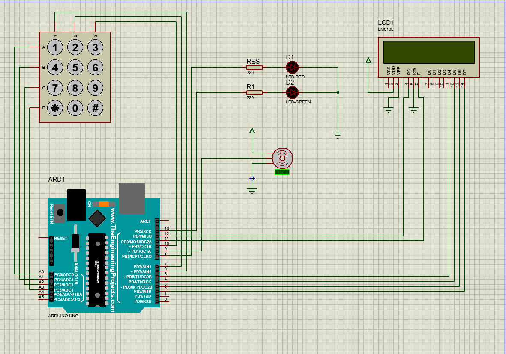

# Digital Combination Lock with 3 Attempts Limit

## Overview
This project details the design, implementation, and simulation of a Digital Combination Lock system built around an Arduino Uno microcontroller. The system features a 4x3 matrix keypad for input, a 16x2 LCD for user feedback, a servo motor to simulate door locking/unlocking, and dual LED indicators (red for alarm, green for access granted). A key feature is a three-attempt limit before a 10-second lockout period is enforced.

## Features
- **Secure Password Entry**: Masked password display using asterisks on the LCD.
- **Attempt Limit**: Allows a maximum of 3 incorrect password attempts before lockout.
- **Lockout Mechanism**: A 10-second lockout period with a flashing red LED alarm after three failed attempts.
- **Visual Feedback**: Green LED indicates successful access, while a red LED signals an alarm during lockout.
- **Door Simulation**: A servo motor simulates the unlocking and relocking of a door.
- **Modular Code**: Clean and well-structured Arduino source code with easily configurable constants.

## Components Used
| Component             | Quantity |
|-----------------------|----------|
| Arduino Uno R3        | 1        |
| 4x3 Matrix Keypad     | 1        |
| 16x2 LCD (LM016L)     | 1        |
| Servo Motor           | 1        |
| Red LED (5 mm)        | 1        |
| Green LED (5 mm)      | 1        |
| 220 Ω Resistor        | 2        |
| +5 V Supply           | 1        |

## Circuit Design & Pin Connections



The circuit was designed and verified using Proteus 8. Below is a summary of the key connections:

### LCD — 16x2 LM016L (4-Bit Mode)
| LCD Pin | Connects To | Purpose           |
|---------|-------------|-------------------|
| VSS     | GND         | Power ground      |
| VDD     | +5 V        | Power supply      |
| VO      | GND         | Contrast          |
| RS      | D12         | Register Select   |
| RW      | GND         | Write-only mode   |
| EN      | D11         | Enable clock      |
| D4      | D5          | 4-bit data        |
| D5      | D4          | 4-bit data        |
| D6      | D3          | 4-bit data        |
| D7      | D2          | 4-bit data        |
| A (BL+) | +5 V        | Backlight anode   |
| K (BL−) | GND         | Backlight cathode |

### 4x3 Matrix Keypad
| Keypad Pin | Arduino Pin | Notes                        |
|------------|-------------|------------------------------|
| A (Row 1)  | A0          | Analog pin as digital I/O    |
| B (Row 2)  | A1          | Analog pin as digital I/O    |
| C (Row 3)  | A2          | Analog pin as digital I/O    |
| D (Row 4)  | A3          | Analog pin as digital I/O    |
| 1 (Col 1)  | D6          | Digital I/O                  |
| 2 (Col 2)  | D7          | Digital I/O                  |
| 3 (Col 3)  | D10         | Digital I/O                  |

### Servo Motor
| Wire Colour       | Connects To | Purpose                               |
|-------------------|-------------|---------------------------------------|
| (Signal)          | D9          | PWM control: 0° = locked, 90° = open  |
| Red (VCC)         | +5 V        | Power supply                          |
| Brown / Black (GND)| GND         | Common ground                         |

### LED Indicators
| LED   | Pin | Resistor | Active When                                    |
|-------|-----|----------|------------------------------------------------|
| Red   | D8  | 220 Ω    | 3rd wrong attempt (flashes 10 s)               |
| Green | D13 | 220 Ω    | Correct password (solid 5 s)                   |

## System Flowchart
(A detailed flowchart is available in the `docs/Embedded Systems – Final Project.pdf` document, illustrating the complete operational logic from power-on through all execution paths.)

## Arduino Source Code
The core logic is implemented in Arduino C++. The `src/TestCode.ino` file contains the complete source code. Key libraries used include `LiquidCrystal.h`, `Keypad.h`, and `Servo.h`.

**Default Password:** `1234`

## Repository Structure

```
DigitalCombinationLock/
├── assets/
│   └── circuit_diagram.png
├── docs/
│   ├── Embedded Systems – Final Project.pdf
│   └── video_script.md
├── src/
│   ├── TestCode.ino
│   ├── TestCode.ino.standard.hex
│   └── TestCode.ino.with_bootloader.standard.hex
├── simulation/
│   ├── Project Backups/
│   │   └── ... (backup files)
│   ├── test_Project.pdsprj
│   └── test_Project.pdsprj.AHMED.HP.workspace
└── README.md
```
- **`assets/`**: Contains images and other static assets used in the README or documentation.
- **`docs/`**: Holds documentation files, including the final project report and video script.
- **`src/`**: Contains the Arduino source code and compiled hex files.
- **`simulation/`**: Stores Proteus simulation files and project backups.
- **`README.md`**: This file, providing an overview of the project.


## Simulation and Results
The system was simulated and verified using Proteus 8. All functional test cases passed, demonstrating the correct operation of the lock, attempt limit, lockout, and visual feedback mechanisms.

## Future Enhancements
Potential improvements for future versions include:
- **EEPROM-based password persistence**: For storing passwords securely.
- **I²C LCD interface**: To reduce pin usage on the Arduino.
- **Audio buzzer feedback**: For additional user interaction.
- **Millis()-based non-blocking timing**: To improve system responsiveness during timed states.
- **Multi-user password table**: To support multiple users.
- **Wireless notification module**: For remote security monitoring.

## Authors
- **Ahmed Osrof**
- **Abdul Rahman Salah**

